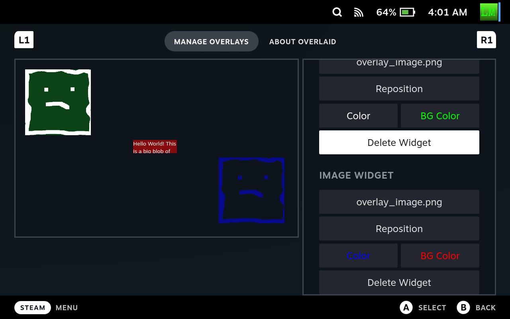

# OverLaid

This is a Decky plugin for creating custom Steam Deck in-game overlays



## General

This plugin allows creating custom in-game overlays using the built-in overlay manager.
Quickly enable and disable overlays from the Quick Access Menu. Each overlay has a list
of widgets that can be individually manipulated. Text widgets show a textbox and image
widgets show a local image. Widgets can be stored anywhere, but are more convenient to
access in the `~/homebrew/overlays` overlay directories. A directory will be created here 
automatically for each overlay created in the plugin. For positioning widgets, there
is both anchoring, to "anchor" the origin of a widget with respect to display percentages,
and coordinate offsets to adjust the relative positioning of said widget. The color of
the text and image tint can be tweaked as well as the widget background color/opacity. 
PNG and JPEG images are supported.

## Manual Usage
Each directory in `~/homebrew/overlays` that contains an `overlay.json` file will be
treated as an overlay with the directory name used as the name of said overlay. When using
image widgets, 

```json
{
    "widgets": [
        {
            "id": "5073732620140945",
            "type": "text",
            "content": "Hello World! This is a big blob of test text that will surely word wrap correctly",
            "width": 200,
            "height": 60,
            "vertical_anchor": 0.5,
            "horizontal_anchor": 0.5,
            "x_offset": -100,
            "y_offset": -30,
            "color": [1, 1, 1, 1],
            "bg_color": [1, 0, 0, 0.5]
        },
        {
            "id": "008612669137711748",
            "type": "image",
            "content": "overlay_image.png",
            "width": 300,
            "height": 300,
            "vertical_anchor": 0,
            "horizontal_anchor": 0,
            "x_offset": 50,
            "y_offset": 50,
            "color": [1, 1, 1, 1],
            "bg_color": [0, 1, 0, 0.2]
        }
    ]
}
```

## Building

Install pnpm and run `pnpm i` in the repo directory. Build with: `pnpm run build`. Run the `build.sh` script
for compiling the backend if on a system with Bash, otherwise compile manually. Copying the
project to the SDH plugins directory ~/homebrew/plugins at this point will install it. The contents of the
`backend/out` need to be copied to `OverLaid/bin` when installing. The VSCode
task handles copying the project to the Deck cleanly without any unnecessary
files and handles file permissions. 
